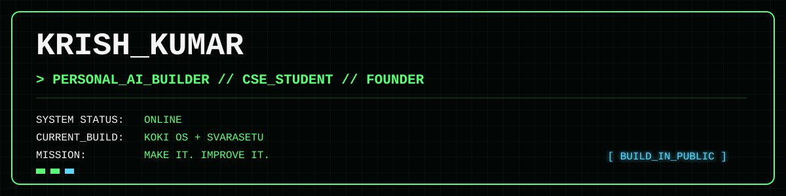

<div align="center">



<br/>


</div>

---

## 🧭 About Me

```yaml
Name:          Krish Kumar
Role:          Founder @ Kryphix.co | B.Tech CSE, AKTU (Batch 2025–29)
Position:      I Can Lead From The Front

Building:      KOKI OS — a model-agnostic AI companion
               SvaraSetu — an AI-powered guitar companion

Also:          Social Media Team — E-Cell SRGC

Philosophy:    Make it and Improve it

Aspiring to:   Content Creator · Guitarist · Learner · Indian Army Officer

Grounded by:   Guitar · Discipline · Devotion

Fun fact:      Started with a 25-line terminal chatbot —
               now learning to turn ideas into real products.
```

---

## 🚧 What I'm Building

<table align="center">
<tr>

<td width="33%" valign="top">

### 🧠 KOKI OS

My personal AI companion.

**Focused on**

* Memory
* Tools
* Personalization
* Multi-model support
* BYOK architecture

`BUILDING`

</td>

<td width="33%" valign="top">

### 🎸 SvaraSetu

AI guitar companion built around:

* Chord generation
* Guitar tuner
* Chord detection
* Real-time audio
* Guitar learning

`BUILDING`

</td>

<td width="33%" valign="top">

### 🏢 Kryphix

My product umbrella for experimenting, building and shipping technology.

**Focus**

* AI products
* Product design
* Experiments
* Building in public

`EARLY STAGE`

</td>

</tr>
</table>

---

## 🎯 Current Focus

```text
01  LEARNING
    Python · C · JavaScript · Web Development

02  BUILDING
    KOKI OS · SvaraSetu

03  EXPLORING
    AI · Automation · Product Design · Content Creation

04  IMPROVING
    GitHub · Communication · Problem Solving

05  LONG TERM
    Build products people actually use.
```

> I started with a small terminal chatbot.
> Now I'm learning how to turn ideas into products.

---

## 📊 GitHub Stats

<div align="center">


</div>

<div align="center">


</div>

---

## 🐍 Contribution Snake

<div align="center">


</div>

---

## 🤖 KOKI OS

<div align="center">


</div>

<p align="center">

<i>
A personal AI companion focused on memory, tools, personality
and the ability to work across different AI models.
</i>

</p>

<div align="center">

`PYTHON` · `AI` · `MEMORY` · `TOOLS` · `BYOK`

</div>

---

## 🎸 SvaraSetu

<div align="center">


</div>

<p align="center">

<i>
An AI guitar companion designed to actually listen —
from chords and diagrams to tuning and real-time detection.
</i>

</p>

---

## 🚀 Projects

<table align="center">
<tr>

<td width="50%" valign="top">

### 🧠 KOKI OS

Model-agnostic personal AI companion with **BYOK** architecture.

**Features**

`Memory` `Tools` `Tasks` `Projects` `World Monitor` `Student Hub`

**Stack**

`React` `Vite` `Tailwind` `FastAPI` `Supabase`

</td>

<td width="50%" valign="top">

### 🎸 SvaraSetu

AI guitar companion for chords, tuning and real-time audio detection.

**Features**

`Chord Generation` `Tuner` `Chord Detection` `SVG Diagrams`

**Stack**

`React` `Web Audio API` `Pitchy.js` `Gemini API`

</td>

</tr>

<tr>

<td colspan="2" align="center">

### 🏢 Kryphix.co

The umbrella behind the products and experiments I'm building.

`AI` · `Product Design` · `Build in Public`

</td>

</tr>
</table>

<div align="center">


</div>

---

## 🛠️ Tech Stack

<div align="center">


</div>

---

## 🧭 Explore

<div align="center">

| 🎯 Looking for          | 🔗                                                           |
| ----------------------- | ------------------------------------------------------------ |
| 🧠 KOKI OS              | [View Project](https://github.com/krishkumarvl/PROJECT-KOKI) |
| 🎸 SvaraSetu            | [View Project](https://github.com/krishkumarvl/SvaraSetu)    |
| 💼 Professional profile | [LinkedIn](https://linkedin.com/in/krishkumarvl)             |
| 📸 Content & life       | [Instagram](https://instagram.com/krishkumarvl)              |
| 🎬 Videos               | [YouTube](https://youtube.com/@krishkumarvl)                 |
| 💻 Coding profile       | [HackerRank](https://hackerrank.com/kk5805705)               |

</div>

---

## 🌐 Connect With Me

<div align="center">

[](https://linkedin.com/in/krishkumarvl)

[](https://x.com/krishkumarvl)

[](https://instagram.com/krishkumarvl)

[](https://youtube.com/@krishkumarvl)

[](https://hackerrank.com/kk5805705)

</div>

---

<div align="center">

### 💬 "Discipline is the bridge between goals and accomplishment."


**Thanks for stopping by. Keep building. Keep improving.**

`KRISH_OS // ALWAYS LEARNING`

</div>
